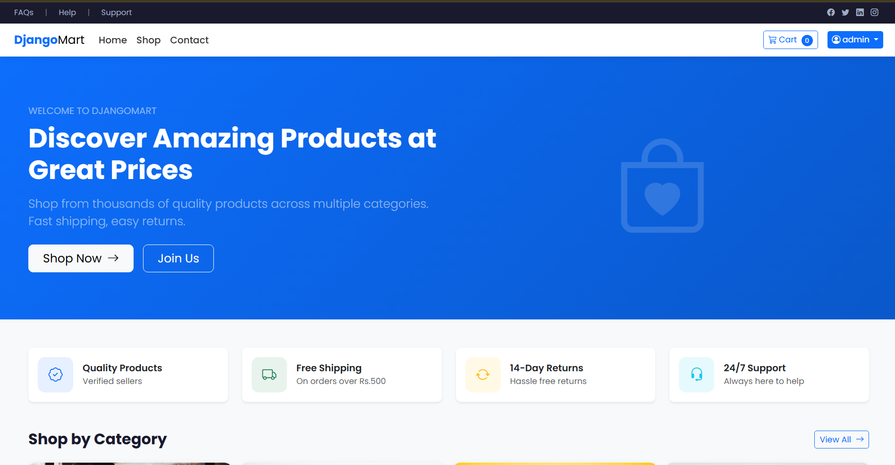
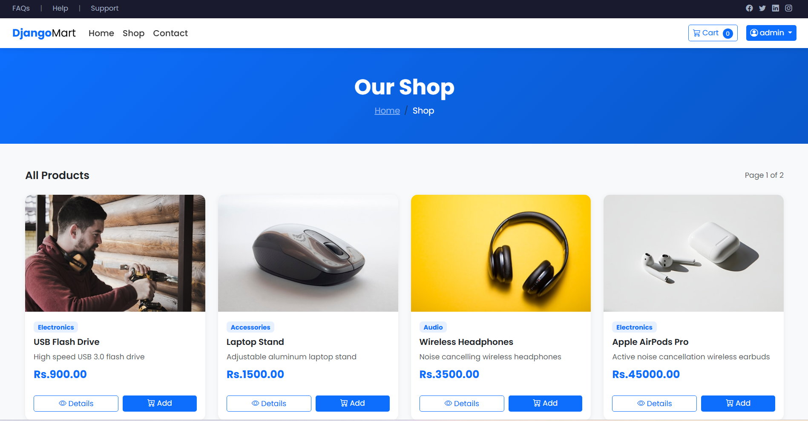
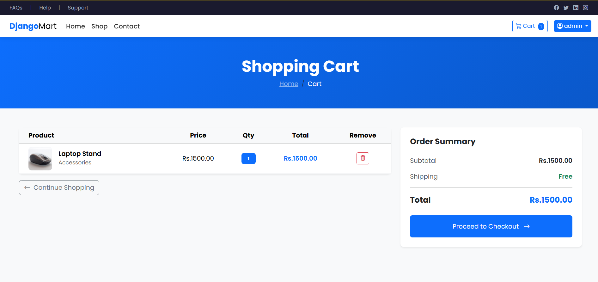
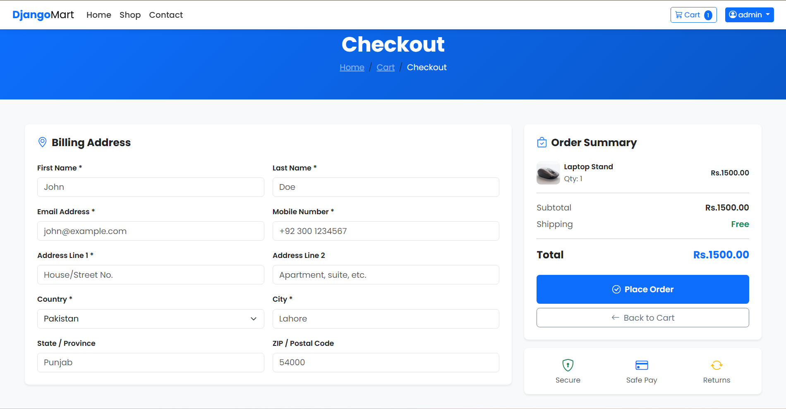
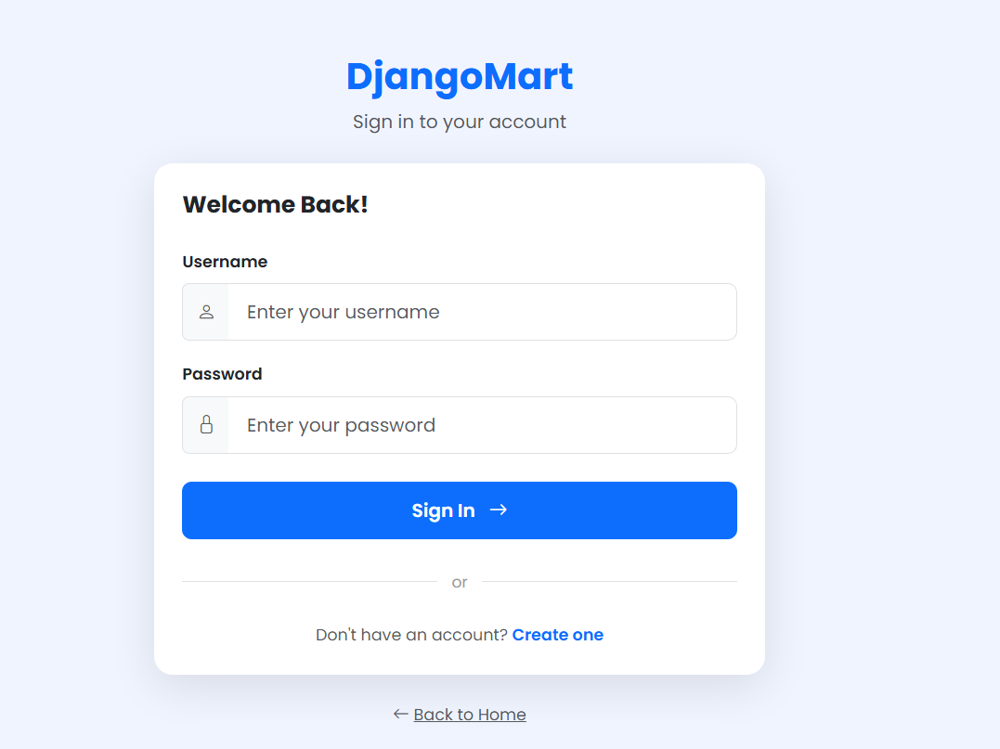
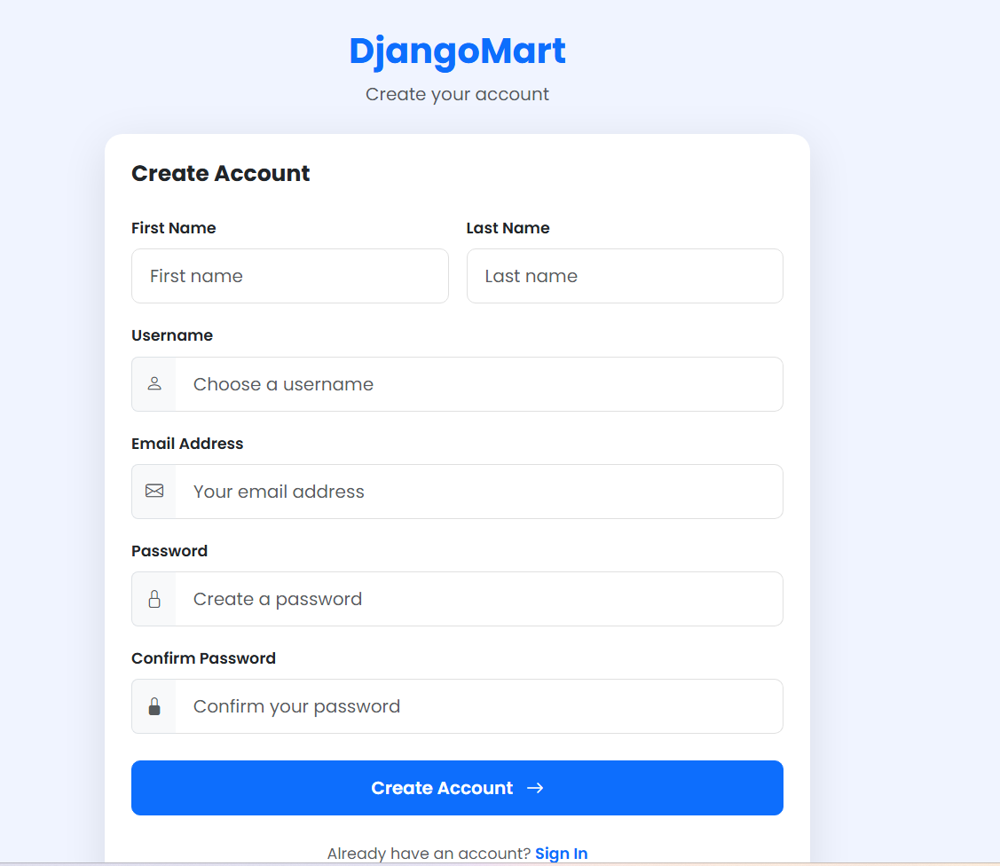

# 🛒 DjangoMart

A modern E-commerce web application built with Django that allows users to browse products, manage their cart, and place orders through a clean and responsive interface.

> This project was developed as part of my Django learning journey and demonstrates core web development concepts including authentication, CRUD operations, session management, and deployment.

---

## 🌐 Live Demo

**Website:** https://furqan.pythonanywhere.com

---


## 📸 Screenshots

### Home Page



### Shop Page



### Product Details


### Shopping Cart



### Checkout



### Login



### Register




## ✨ Features

- User Registration & Login
- Product Catalog
- Product Details
- Shopping Cart
- Checkout System
- Django Admin Dashboard
- Email Configuration
- Static File Management
- Responsive UI
- Secure Environment Variables (.env)
- Production Deployment

---

## 🛠 Tech Stack

### Backend

- Python 3
- Django 6

### Database

- SQLite

### Frontend

- HTML
- CSS
- Bootstrap
- JavaScript

### Deployment

- PythonAnywhere
- WhiteNoise

### Version Control

- Git
- GitHub

---

## 📂 Project Structure

```
DjangoMart
│
├── newEcommerce/
├── product_app/
├── templates/
├── static/
├── staticfiles/
├── manage.py
├── requirements.txt
└── README.md
```

---

## ⚙ Installation

Clone the repository

```bash
git clone https://github.com/FurqanAthar28/djangomart.git
```

Move into the project

```bash
cd djangomart
```

Create virtual environment

```bash
python -m venv .venv
```

Activate virtual environment

### Windows

```bash
.venv\Scripts\activate
```

### Linux / macOS

```bash
source .venv/bin/activate
```

Install dependencies

```bash
pip install -r requirements.txt
```

Run migrations

```bash
python manage.py migrate
```

Run development server

```bash
python manage.py runserver
```

---

## 🚀 Deployment

The application is deployed on **PythonAnywhere**.

---

## 📚 What I Learned

During this project I learned:

- Django Models
- Django ORM
- URL Routing
- Template Engine
- Forms
- Authentication
- Sessions
- CRUD Operations
- Static & Media Files
- Django Admin
- Git & GitHub
- Production Deployment
- Environment Variables
- WhiteNoise Configuration

---

## 🔮 Future Improvements

- Product Search
- Product Categories
- Wishlist
- Order History
- Payment Gateway
- Product Reviews
- PostgreSQL
- Docker
- REST API
- JWT Authentication

---

## 👨‍💻 Author

**Furqan Athar**

GitHub:
https://github.com/FurqanAthar28

---

⭐ If you found this project helpful, consider giving it a star.
